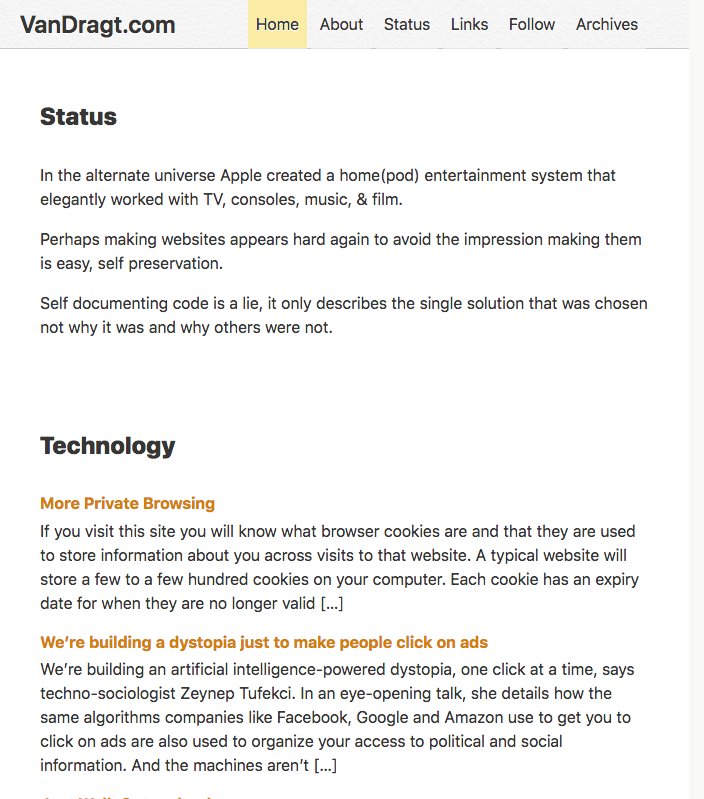

wordpress-vandragt 2015
=======================
VanDragt.com theme.

# Setup

1. Create a page "Home" /home with template "Category Grouped Timeline" (static: Frontpage)
2. Create a page "Timeline" /blog (static: Posts page)
3. Permalink format: /blog/%year%/%monthnum%/%postname%